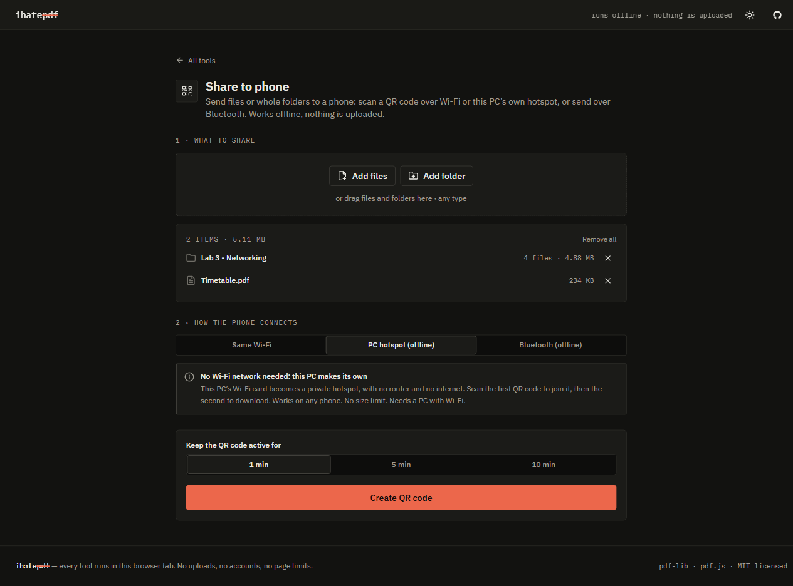
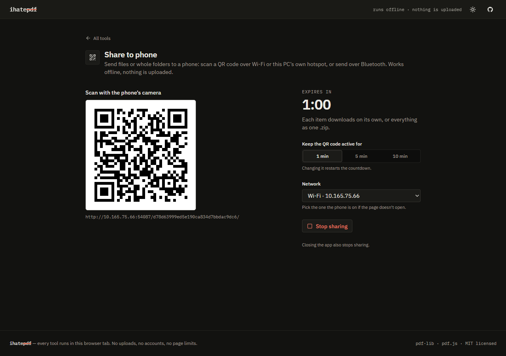
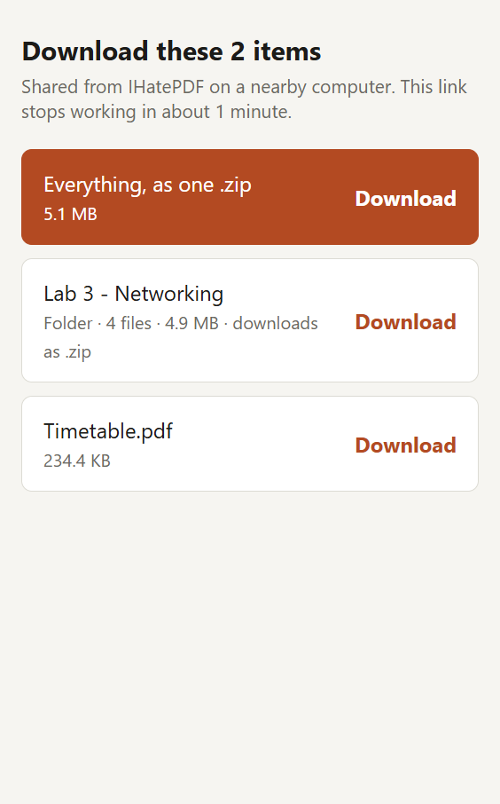
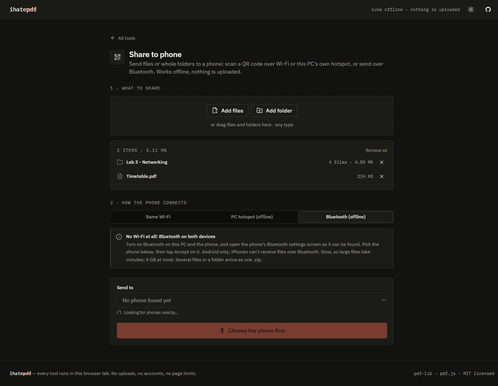

<div align="center">


# IHatePDF

**Edit, compress, convert and fix PDFs — on your own computer.**<br>
28 PDF tools, plus sending files to a phone offline. Real text editing. No uploads, no accounts, no watermarks, no AI.

[](https://github.com/Burthcer/IHatePDF/releases/latest/download/IHatePDF-Setup.exe)

[](https://github.com/Burthcer/IHatePDF/releases/latest)


[](LICENSE)

**New in 1.3.0:** big files use up to 6× less memory, a built-in memory fail-safe protects the PC, and Hindi, Marathi, Chinese and Japanese text works in every tool that writes text. [What changed](#whats-new-in-130)

<br>

<picture>
  <source media="(prefers-color-scheme: dark)" srcset="docs/screenshots/home-dark.png">
  
</picture>

</div>

---

## Why IHatePDF

- **Edit the actual text.** Double-click any paragraph and retype it, like in Word. The paragraph reflows in the document's own font, and the old characters are removed from the file, not hidden under a white box.
- **Compress to the size you need.** Choose a preset, or type a target like `2 MB` or `400 KB` and it finds the best quality that fits. For example, a 35 MB scan becomes 1.7 MB with no visible difference.
- **Your files never leave your computer.** There's no server and nothing to upload to. Every tool runs locally, and the app works with the network unplugged.
- **Send files to a phone, offline.** Share files or whole folders to a phone with a QR code, over Wi-Fi, this PC's own hotspot or Bluetooth. Nothing goes through the internet. See [Share to phone](#share-to-phone).
- **Results save themselves.** When a tool finishes, the file saves after 5 seconds under a sensible name. Rename it during the countdown if you want. In the desktop app, files land in `Downloads\IHatePDF`.

<table>
  <tr>
    <td width="50%"><br><sub><b>Edit PDF</b> — retype a paragraph in place, change font, size, color and alignment.</sub></td>
    <td width="50%"><br><sub><b>Compress</b> — custom target: 35.5 MB → 1.95 MB for a 2 MB target, auto-saving in 4 s.</sub></td>
  </tr>
  <tr>
    <td width="50%"><br><sub><b>Organize</b> — drag thumbnails to reorder, rotate, duplicate or delete pages.</sub></td>
    <td width="50%"><br><sub><b>Convert</b> — PowerPoint, Word, Excel, HTML and images to PDF, and back.</sub></td>
  </tr>
</table>

---

## Install on Windows

1. **[Download IHatePDF-Setup.exe](https://github.com/Burthcer/IHatePDF/releases/latest/download/IHatePDF-Setup.exe)** (about 115 MB).
2. **Run it.** Windows may say *"Windows protected your PC"*, because the installer isn't code-signed. Click **More info → Run anyway**.
3. **Click through the setup.** Windows asks once for administrator permission: the installer adds a Windows Firewall rule so phones can download from [Share to phone](#share-to-phone) without the app ever showing a network prompt. You can choose the install folder and whether you want desktop and Start-menu shortcuts.
4. **Open IHatePDF** from the desktop or the Start menu.

**Updating:** download the new setup and run it. It replaces the old version in place (1.1.0 and 1.2.0 included), and your saved files are never touched. The one exception: a 1.1.0 installed under a *different* Windows account stays in that account's *Settings → Apps*; uninstall it there.
**Uninstalling:** *Settings → Apps → IHatePDF → Uninstall*.

### System requirements

| | |
|---|---|
| **Windows** | Windows 10 or 11, 64-bit |
| **Memory** | 4 GB RAM works; 8 GB or more for PDFs over 500 MB |
| **Disk** | About 400 MB for the app, plus free space about the size of the file you're working on |
| **Install** | Administrator permission, once, during setup |

Need nothing but a browser? The same app runs as a web page. See [Run it in a browser instead](#run-it-in-a-browser-instead).

---

## Share to phone

Send files, or whole folders, from the PC to a phone. Nothing is uploaded anywhere and no app is needed on the phone. It's the first tool on the home screen.

1. **Add what to share:** files, folders, or both (buttons or drag and drop).
2. **Pick how the phone connects:**

| | Same Wi-Fi | PC hotspot (offline) | Bluetooth (offline) |
|---|---|---|---|
| **When to use it** | PC and phone are on the same Wi-Fi or network (internet not needed) | No Wi-Fi network at all: the PC's Wi-Fi card makes a private hotspot | No Wi-Fi at all |
| **On the phone** | Scan one QR code, tap Download | Scan a QR code to join the hotspot, then one to download | Open Bluetooth settings so it's visible, pick it in the app, tap Accept |
| **Phones** | Any (Android, iPhone) | Any (Android, iPhone) | Android only (iPhones can't receive files over Bluetooth) |
| **Size limit** | None | None | 4 GB, and slow (large files take minutes) |
| **Folders** | Download as a .zip | Download as a .zip | Sent as one .zip |
| **Needs** | A network | A PC with Wi-Fi | Bluetooth on the PC and the phone |

3. **Choose how long the QR code stays active** (1, 5 or 10 minutes; changing it restarts the countdown). The link stops working when time runs out, when you press **Stop sharing**, or when you close the app. If the app turned the hotspot on, it turns it off again.

With several items, the phone can download each one on its own or everything as one .zip. For Bluetooth, the app never picks a phone for you: you choose it from the phones it finds nearby.

<table>
  <tr>
    <td width="50%"><br><sub><b>Pick what to share and how</b>: a folder and a file, sent over this PC's own hotspot.</sub></td>
    <td width="50%"><br><sub><b>Scan the QR code</b>: active for 1, 5 or 10 minutes.</sub></td>
  </tr>
  <tr>
    <td width="50%"><br><sub><b>On the phone</b>: download each item, or everything as one .zip.</sub></td>
    <td width="50%"><br><sub><b>Bluetooth</b>: finds nearby phones; nothing is chosen until you pick one.</sub></td>
  </tr>
</table>

Share to phone is only in the Windows desktop app; a browser tab can't run it.

---

## All 28 tools

| | Tools |
|---|---|
| ✏️ **Edit** | **Edit PDF** — retype text, move/resize/delete text and images, add text, images, shapes, highlights, whiteout · **Sign** — draw, type or upload · **Fill forms** · **Watermark** — text or image · **Page numbers** · **Redact** — draw boxes or search, removed for good |
| 🗂️ **Organize** | **Merge** · **Split** — ranges, every N pages, one file per page · **Organize pages** · **Rotate** · **Crop** · **Compare** — word-level diff plus visual overlay |
| 📤 **Convert from PDF** | **Word** — headings, lists, tables, bold/italic · **Excel** — detected tables · **PowerPoint** — editable text boxes · **JPG/PNG** — up to 600 dpi · **Markdown** |
| 📥 **Convert to PDF** | **Images** · **Word** · **Excel** · **PowerPoint** · **HTML** — real, selectable text · **Scan** — camera with perspective correction |
| ⚡ **Optimize** | **Compress** — Light / Balanced / Smallest or a custom size · **Repair** — recovers damaged and cut-off files · **PDF/A** — archival |
| 📱 **Share** | **Share to phone** — files and folders to a phone by QR code (Wi-Fi or this PC's hotspot) or Bluetooth, offline |
| 🔒 **Security** | **Protect** — AES-256 password, printing/copying limits · **Unlock** — RC4 and AES files you have the password for |

Password-protected PDFs work in every tool: you type the password once when you open the file.

---

## What's new in 1.3.0

**Much less memory for big files.** Tools read only the parts of a PDF they need from disk and write the result straight to disk, so memory stays about the same for a 5 MB or a 2 GB file.

| Job (desktop app) | 1.2.0 | 1.3.0 |
|---|---|---|
| Watermark a 500 MB PDF | 5.2 GB RAM | 0.9 GB RAM |
| Rotate a 500 MB PDF | 4.7 GB RAM | 1.6 GB RAM |
| Redact 5,000 pages | 8.3 GB RAM | REDACT_RAM |
| Merge two 5,000-page PDFs | 13 s | 3.6 s |

**Memory fail-safe.** The app gives itself a memory budget based on the PC's RAM and leaves the rest for Windows: 1 GB on a 4 GB PC, 4 GB on 8 GB, 8 GB on 16 GB, never more than 16 GB. Near the budget, tools work in smaller pieces. A job that would go over it stops with *"Stopped to protect this PC"* and the app stays usable; a window stuck using too much memory is restarted before Windows runs short.

**Fixes:**
- **Hindi, Marathi, Chinese and Japanese** text now works in Edit PDF, Watermark, Page numbers, Fill forms and the Word, Excel, PowerPoint and HTML to PDF tools. The fonts ship with the app.
- **PDF→Word keeps pictures** where they were on the page.
- **Tables** are detected more reliably in PDF→Word and PDF→Excel.
- **5,000-page files open straight away:** thumbnails are drawn only for the pages on screen.
- **Compare** and **Redact** no longer need memory for every page at once.
- **Crashes** reload the window with a short note instead of leaving it blank.
- **Damaged files** get a plain explanation and a pointer to Repair PDF, instead of a technical error.
- **Share to phone** skips unreadable files in a folder (in use, no permission) instead of failing, and lists them.

Full details and known limits: [release notes](docs/RELEASE_NOTES.md).

---

## How it works

Everything runs on your machine:
- **[pdf-lib](https://pdf-lib.js.org/)** and **[pdf.js](https://mozilla.github.io/pdf.js/)** do the PDF work in Web Workers, so the window never freezes.
- The desktop app wraps the same code in Electron.

**The text editor** is a small PDF engine of its own (`src/features/editPdf/engine/`):
1. It reads each page's drawing instructions and works out every character's font, position and color.
2. It groups those characters into lines and paragraphs.
3. When you retype a paragraph, it removes the old characters from the page without moving anything else, then typesets your new text. It uses the original font when that font contains all the characters, and the closest match otherwise.

**The compressor** handles:
- every common image type in PDFs: JPEG, JPEG 2000, CMYK, color-profiled, palette, 16-bit and transparent;
- DPI-aware downsampling that uses each image's size *as displayed on the page*;
- merging duplicate images and dropping objects nothing uses.

It keeps a re-encoded image only if it actually got smaller. If the whole file can't shrink, you get the original back.

---

## Run it in a browser instead

Don't want to install anything? The same app runs as a web page:

```bash
git clone https://github.com/Burthcer/IHatePDF.git
cd IHatePDF
npm install
npm run dev          # then open the localhost link it prints
```

## More

- [Release notes for 1.3.0](docs/RELEASE_NOTES.md)
- [Test results](docs/TEST_REPORT.md)
- [For developers](HANDOFF.md): how the code is organized, building the installer, and releasing.

## License

[MIT](LICENSE). Free to use, modify and share.
