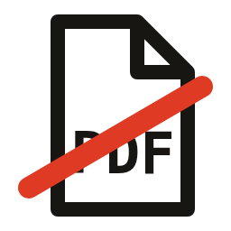
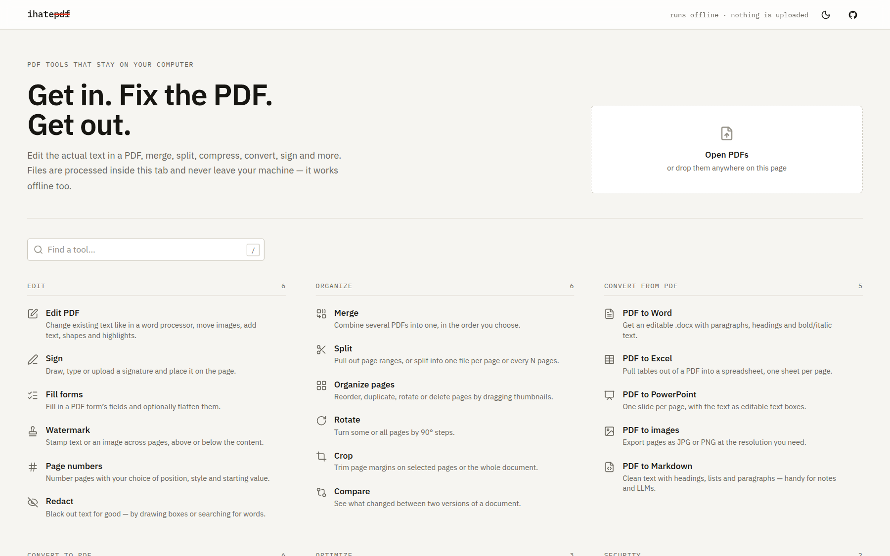
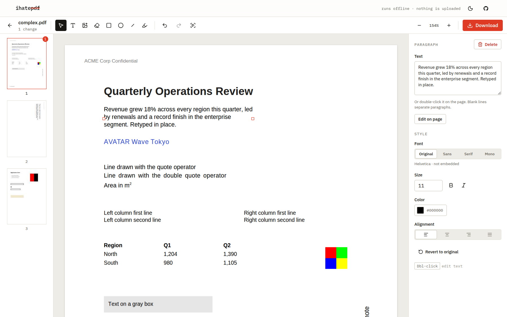
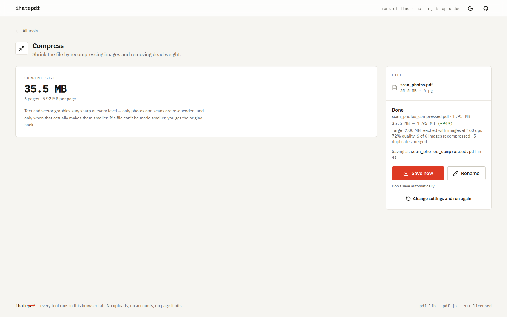
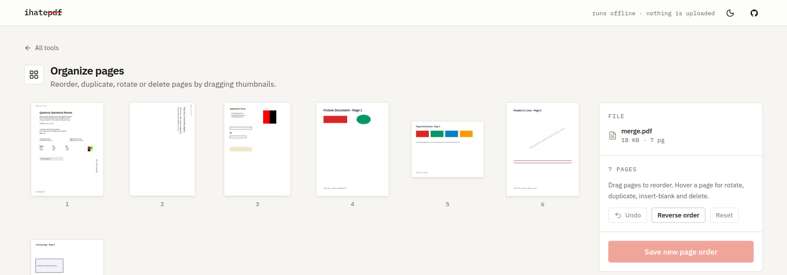
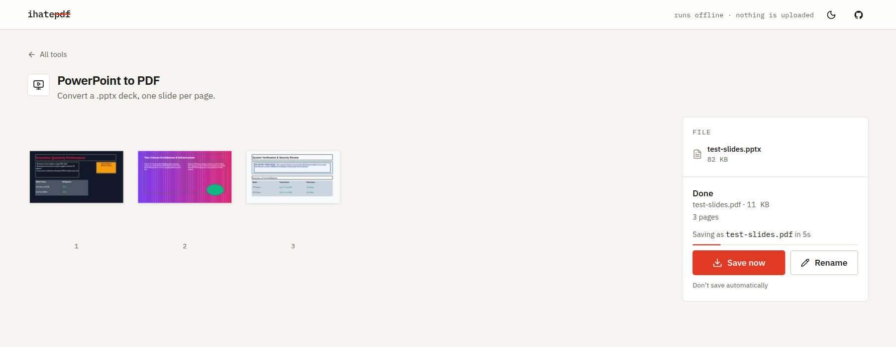

<div align="center">



# IHatePDF

**Edit, compress, convert and fix PDFs — on your own computer.**<br>
28 tools. Real text editing. No uploads, no accounts, no watermarks, no AI.

[](https://github.com/Burthcer/IHatePDF/releases/latest/download/IHatePDF-Setup.exe)

[](https://github.com/Burthcer/IHatePDF/releases/latest)


[](LICENSE)

<br>

<picture>
  <source media="(prefers-color-scheme: dark)" srcset="docs/screenshots/home-dark.png">
  
</picture>

</div>

---

## Why IHatePDF

- **Edit the actual text.** Double-click any paragraph and retype it, like in Word. The paragraph reflows in the document's own font, and the old characters are removed from the file, not hidden under a white box.
- **Compress to the size you need.** Choose a preset, or type a target like `2 MB` or `400 KB` and it finds the best quality that fits. For example, a 35 MB scan becomes 1.7 MB with no visible difference.
- **Your files never leave your computer.** There's no server and nothing to upload to. Every tool runs locally, and the app works with the network unplugged.
- **Results save themselves.** When a tool finishes, the file saves after 5 seconds under a sensible name. Rename it during the countdown if you want. In the desktop app, files land in `Downloads\IHatePDF`.

<table>
  <tr>
    <td width="50%"><br><sub><b>Edit PDF</b> — retype a paragraph in place, change font, size, color and alignment.</sub></td>
    <td width="50%"><br><sub><b>Compress</b> — custom target: 35.5 MB → 1.95 MB for a 2 MB target, auto-saving in 4 s.</sub></td>
  </tr>
  <tr>
    <td width="50%"><br><sub><b>Organize</b> — drag thumbnails to reorder, rotate, duplicate or delete pages.</sub></td>
    <td width="50%"><br><sub><b>Convert</b> — PowerPoint, Word, Excel, HTML and images to PDF, and back.</sub></td>
  </tr>
</table>

---

## Install on Windows

1. **[Download IHatePDF-Setup.exe](https://github.com/Burthcer/IHatePDF/releases/latest/download/IHatePDF-Setup.exe)** (about 115 MB).
2. **Run it.** Windows may say *"Windows protected your PC"*, because the installer isn't code-signed. Click **More info → Run anyway**.
3. **Click through the setup.** You can choose the install folder and whether you want desktop and Start-menu shortcuts.
4. **Open IHatePDF** from the desktop or the Start menu.

**Updating:** download the new setup and run it. It replaces the old version in place, and your saved files are never touched.
**Uninstalling:** *Settings → Apps → IHatePDF → Uninstall*.

Need nothing but a browser? The same app runs as a web page. See [Run from source](#run-from-source).

---

## All 28 tools

| | Tools |
|---|---|
| ✏️ **Edit** | **Edit PDF** — retype text, move/resize/delete text and images, add text, images, shapes, highlights, whiteout · **Sign** — draw, type or upload · **Fill forms** · **Watermark** — text or image · **Page numbers** · **Redact** — draw boxes or search, removed for good |
| 🗂️ **Organize** | **Merge** · **Split** — ranges, every N pages, one file per page · **Organize pages** · **Rotate** · **Crop** · **Compare** — word-level diff plus visual overlay |
| 📤 **Convert from PDF** | **Word** — headings, lists, tables, bold/italic · **Excel** — detected tables · **PowerPoint** — editable text boxes · **JPG/PNG** — up to 600 dpi · **Markdown** |
| 📥 **Convert to PDF** | **Images** · **Word** · **Excel** · **PowerPoint** · **HTML** — real, selectable text · **Scan** — camera with perspective correction |
| ⚡ **Optimize** | **Compress** — Light / Balanced / Smallest or a custom size · **Repair** — recovers damaged and cut-off files · **PDF/A** — archival |
| 🔒 **Security** | **Protect** — AES-256 password, printing/copying limits · **Unlock** — RC4 and AES files you have the password for |

Password-protected PDFs work in every tool: you type the password once when you open the file.

---

## How it works

Everything runs on your machine:
- **[pdf-lib](https://pdf-lib.js.org/)** and **[pdf.js](https://mozilla.github.io/pdf.js/)** do the PDF work in Web Workers, so the window never freezes.
- The desktop app wraps the same code in Electron.

**The text editor** is a small PDF engine of its own (`src/features/editPdf/engine/`):
1. It reads each page's drawing instructions and works out every character's font, position and color.
2. It groups those characters into lines and paragraphs.
3. When you retype a paragraph, it removes the old characters from the page without moving anything else, then typesets your new text. It uses the original font when that font contains all the characters, and the closest match otherwise.

**The compressor** handles:
- every common image type in PDFs: JPEG, JPEG 2000, CMYK, color-profiled, palette, 16-bit and transparent;
- DPI-aware downsampling that uses each image's size *as displayed on the page*;
- merging duplicate images and dropping objects nothing uses.

It keeps a re-encoded image only if it actually got smaller. If the whole file can't shrink, you get the original back.

---

## Run from source

```bash
git clone https://github.com/Burthcer/IHatePDF.git
cd IHatePDF
npm install
npm run dev          # open the printed localhost URL
```

| Command | What it does |
|---|---|
| `npm run build` | Type-checks and builds the web app into `dist/` (host it anywhere as static files). |
| `npm run build:exe` | Builds the Windows installer at `FinalApp/IHatePDF-Setup.exe`. |
| `npm test` | Runs 45 automated checks: conversions, the editing engine on a deliberately awkward PDF, encryption, and every tool. |
| `node scripts/e2e/all-tools.mjs` | Clicks through all 28 tools in a real browser and checks every output (needs `npx vite preview --port 4173`). |

Every push to `main` builds the installer on GitHub and publishes it as the release for the version in `package.json`.

## Documentation

- [Release notes](docs/RELEASE_NOTES.md): what's new in this version.
- [Test report](docs/TEST_REPORT.md): the full test results.
- [Developer handoff](HANDOFF.md): architecture, code map and conventions.
- [Publishing a release](docs/GITHUB_PUBLISH_GUIDE.md).

## License

[MIT](LICENSE). Free to use, modify and share.
